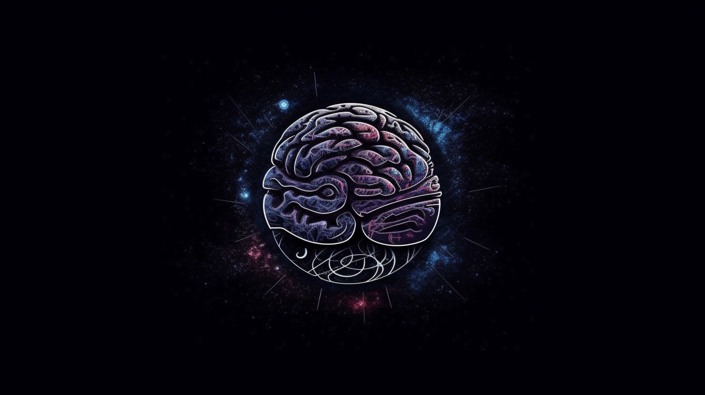

# Lore Note

A knowledge note tool/solution that combines engineering and AI.

## Reason for creating Lore Note

At the most suitable time point, all kinds of information and data in the past are integrated and managed.

## Sketch Plan

- A complete information cycle, including collection (active/passive), sorting (automatic/manual), categorization (automatic/manual), output (interface/API).
- Only adapters and connectors, as well as docking for open source software, do not reinvent the wheel.
- Provide a complete security solution, not just glue.
- Advanced technology stacks are lightweight enough to avoid overfitting and avoid introducing large things.

## Why Choose GPLv3

Knowledge belongs to everyone and should be fully opensource.
